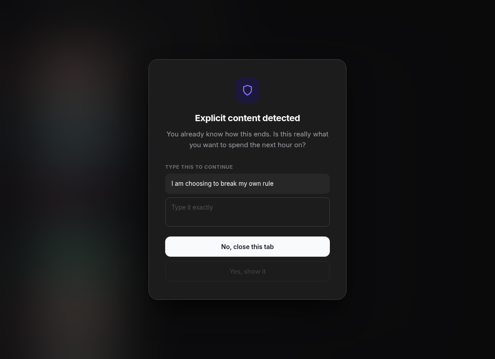
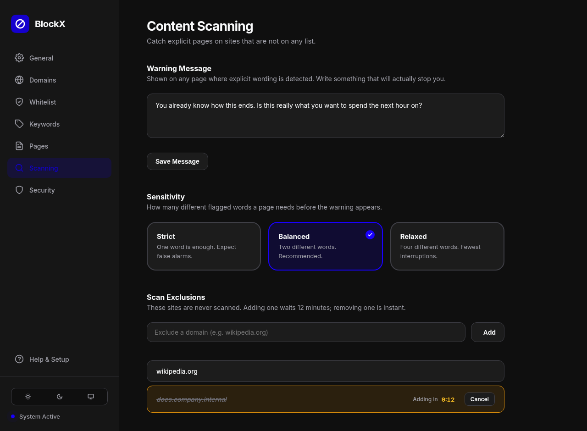
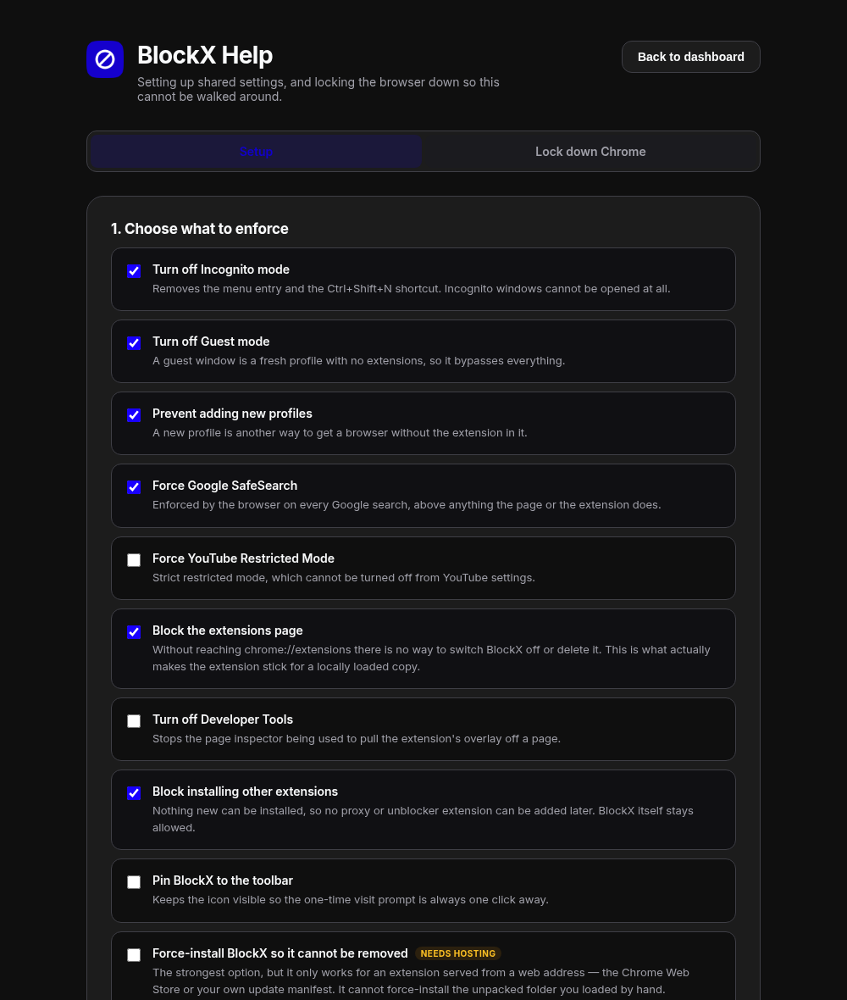

<div align="center">


# BlockX

**A content blocker built for the moment you want to turn it off.**

Anything can block a website. What makes this different is that the ways out are
slow, deliberate, and follow you across every profile on your machine.

[](https://developer.chrome.com/docs/extensions/mv3/intro/)
[](#install)
[](#architecture)
[](LICENSE)



</div>

---

## Why this exists

Most blockers fail the same way. Not because the filtering is weak, but because
disabling them takes one click at exactly the moment you least want friction.

BlockX is built on the opposite assumption: **you will try to get around it, and
that is the part worth designing.**

| The usual escape route | What happens here |
|---|---|
| Delete the site from the blocklist | Takes **12 minutes**, and only if you keep the dashboard open the whole time |
| Import an edited settings file | Held for 12 minutes unless you affirm your intention first |
| Hand-edit the settings file on disk | Loosening changes are ignored and the file is rewritten |
| Open a second profile, or Incognito | One command makes the **browser itself** refuse |
| Search for it instead of visiting it | The query is read and refused before the page is fetched |
| A site that is on no list at all | The page is scanned and held behind a warning |
| Flip `disabled` in DevTools | Every decision is made in the service worker, not the DOM |

None of this is unbreakable. You wrote the rules and you have the source. It
works because you want it to — it just refuses to be easy in the wrong moment.

---

## Features

### Blocking

- **Four independent layers.** Network-level rules, a navigation check, a
  main-world SPA hook, and an in-page scanner. Something has to get past all of
  them.
- **3,553 bundled domains** and **349 keywords**, plus your own domains,
  keywords, path prefixes and exact pages.
- **Search queries are inspected**, not just URLs — across Google, Bing,
  DuckDuckGo, Yahoo, Yandex, Brave, Ecosia, YouTube, Reddit and others, whatever
  order the parameters arrive in.
- **Whitelist accepts real hosts** — domains, IPv4, IPv6, `localhost`, container
  names, with an optional port. Bare hosts and literal addresses match exactly,
  so an entry of `com` can never whitelist the internet.
- **SafeSearch is enforced** on Google, Bing and DuckDuckGo, and YouTube Shorts
  are hidden.

### On-page scanning

Pages that are on no list get read before you see them. If enough distinct
flagged terms appear, the page stays hidden behind a frosted overlay showing a
message you wrote, and any playing video or audio is paused.

Scanning counts **distinct** terms against a sensitivity you choose, and matches
on word boundaries — so `analysis`, `button`, `grapes` and `cocktail` do not trip
it, while a page that is genuinely explicit trips immediately. A 2.5 MB page
costs well under one frame.

### Getting past it

- **12-minute cooling-off** on anything that weakens protection, and the
  dashboard tab has to stay open for the whole countdown or the change is void.
- **One-time visit.** Retype a phrase you chose to earn a single visit, in a
  single tab. Reloading or opening it elsewhere blocks it again.
- **Domains you blocked yourself are never unlockable.** That was a deliberate
  decision; it is treated as one.
- **Password-locked dashboard**, and an intention check before any settings
  import.

### One set of settings, everywhere

| Layer | Covers | Setup |
|---|---|---|
| Account sync | Every profile on the same Google account, any device | None |
| Settings file | Every profile on **one machine**, whatever account each uses | One command |

Reconciled by revision — the most recent change wins. See
[Shared settings](#shared-settings).

### Locking the browser down

A guest window, a new profile or an Incognito tab has no extensions in it. No
extension can close those; a **browser policy** can. The built-in generator turns
a set of checkboxes into a single command for Linux, macOS or Windows — see
[Browser lockdown](#browser-lockdown).

---

## Install

<table>
<tr><td width="60%">

```
1. Download or clone this repository
2. Open  chrome://extensions
3. Turn on  Developer mode
4. Load unpacked  →  select the BlockX folder
```

That is enough to start. The dashboard opens automatically.

Two optional extras are worth the few minutes:
**[shared settings](#shared-settings)** and
**[browser lockdown](#browser-lockdown)**.

</td><td>



</td></tr>
</table>

> [!NOTE]
> `manifest.json` pins a public key so the extension keeps the same ID on every
> machine, which the native helper and the browser policies both need to name
> up front.

---

## Shared settings

A Chrome extension cannot read or write ordinary files — that is a hard boundary
in the browser. Reaching a real file needs a small program outside the sandbox:

```bash
cd native
python3 install.py        # once per machine, not per profile
```

Restart the browser. Settings then live at:

| Platform | Path |
|---|---|
| Linux | `~/.config/blockx/settings.json` |
| macOS | `~/Library/Application Support/BlockX/settings.json` |
| Windows | `%APPDATA%\BlockX\settings.json` |

`native/blockx_host.py` is about a hundred lines that do nothing but read and
write one JSON file. It never interprets what your settings mean.

Everything written there is checksummed. A file that no longer matches its
checksum was edited outside the dashboard, so its **tightening** changes are
accepted and its **loosening** changes are discarded — otherwise the file would
be a way around the 12-minute wait.

<details>
<summary><b>Flatpak browsers need one extra step</b></summary>

<br>

A Flatpak browser cannot see the host's `/etc`. Its launcher symlinks policy
files in **once, at startup**, so a file written while the browser is running
stays invisible however many windows you close:

```bash
flatpak kill com.google.Chrome
```

Then start it again. The settings helper handles Flatpak automatically — it
detects the sandbox and uses your real home rather than the browser's private
config tree, so every browser shares one file.

</details>

---

## Browser lockdown



Open **Help & Setup → Lock down Chrome**, tick what you want, pick your system,
and copy the one command it produces.

| Option | Effect |
|---|---|
| Turn off Incognito | No Incognito window can be opened |
| Turn off Guest mode | A guest window is a profile with no extensions |
| Prevent adding profiles | Closes the other way to get a clean browser |
| Force SafeSearch | Enforced above anything a page or extension does |
| Force YouTube Restricted | Cannot be turned off from YouTube settings |
| Block the extensions page | **This is what makes BlockX stick** on a locally loaded copy |
| Turn off Developer Tools | Stops the inspector being used on the overlay |
| Block other extensions | No proxy or unblocker can be added later |

Every option is a documented Chromium policy, each is explained in the page
before you run it, and a revert command is generated alongside.

> [!WARNING]
> The command needs an administrator password and applies to **every profile and
> every user** of that browser on the machine. Read it before running it — it is
> plain text and does exactly what is listed.

---

## Architecture

No build step, no bundler, no dependencies. Load the folder and it runs.

```
src/
  background.js       service worker — rules, blocking decisions, the pending
                      engine, temporary passes. All authority lives here.
  content.js          the anti-flash barrier, the page scanner, the warning
  inject.js           main-world hook for SPA route changes
  config.js           shared vocabulary: host parsing, filters, search queries
  settings-sync.js    reconciles local, account sync and the settings file
  options/            the dashboard
  popup/              toolbar popup and the one-time visit
  help/               setup guide and the policy generator
native/
  blockx_host.py      reads and writes one JSON file, nothing else
  install.py          registers the helper with every browser it finds
```

**Two rules the code holds to:**

1. **No decision that matters is taken from the DOM.** A page inspector can
   rewrite anything in a tab, including a button's `disabled` attribute, so the
   service worker judges every unlock and every block.
2. **Failures close, they do not open.** An unreachable service worker, an
   unparseable file or a rejected message never reveals a page.

<details>
<summary><b>Why word boundaries matter more than they sound</b></summary>

<br>

The bundled keyword list contains short words. Matched as plain substrings —
which is what a naive filter does — `anal` hits *analysis*, `butt` hits *button*,
`rape` hits *grape*, `cock` hits *cocktail* and `scat` hits *scattered*.

Page scanning therefore uses a word-boundary filter and counts **distinct** terms
against a threshold. A news article that uses one word twenty times does not trip
it; a page that uses several different ones trips at once.

</details>

---

## Development

Everything is plain JavaScript, so there is nothing to build:

```bash
node --check src/background.js       # syntax
python3 -m py_compile native/*.py
```

The behaviour that matters is covered by standalone suites that stub the Chrome
APIs and run under Node — the cooling-off lifecycle, settings reconciliation,
host parsing, search blocking, scanner cost and correctness, the policy
generator, and reproductions of every bypass that has been found and closed.

---

## Credits

Built on public work — the games, the domain list and the keyword dictionary all
come from elsewhere. Full attributions in **[CREDITS.md](CREDITS.md)**.

## License

Free for personal, educational and non-commercial use. It may not be sold or
charged for. See **[LICENSE](LICENSE)**.
